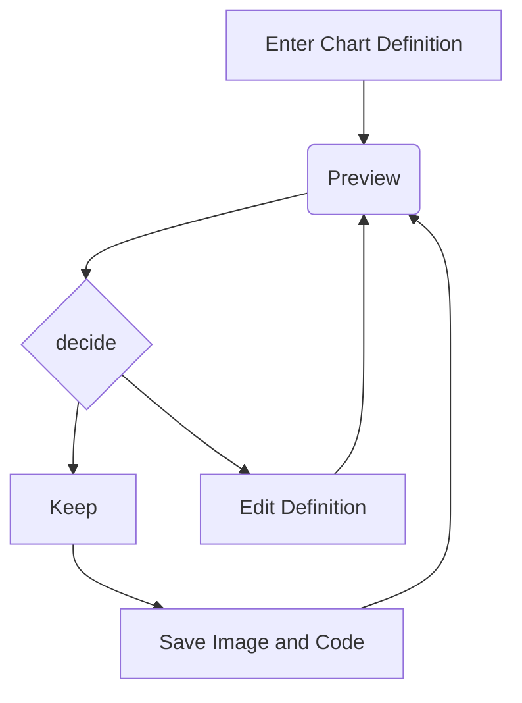
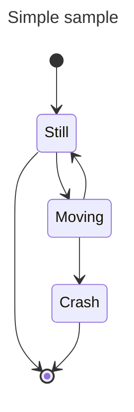
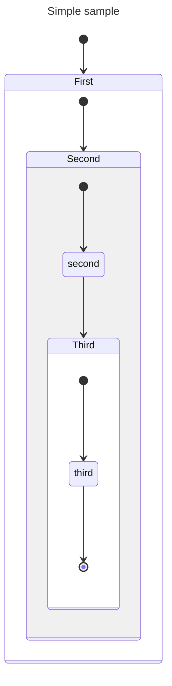

<!-- https://marketplace.visualstudio.com/items?itemName=bierner.markdown-mermaid -->
<!-- https://mermaid.js.org/intro/n00b-gettingStarted.html -->
<!-- Powerful VSCode Tips And Tricks For Python Development And Design - https://youtu.be/fj2tuTIcUys?t=815 -->

